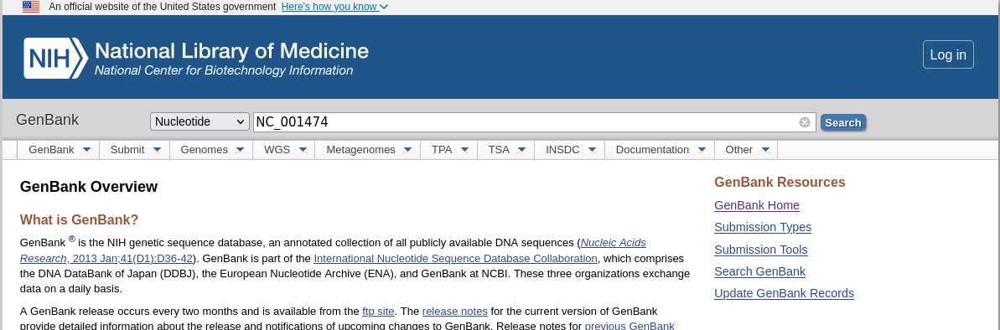
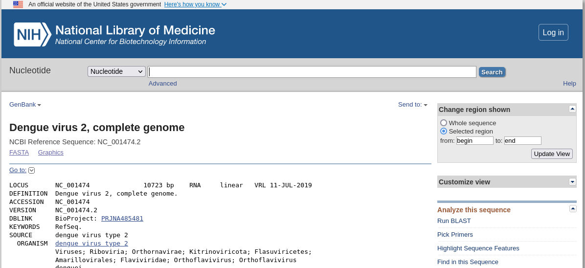

# Instalación y carga de paquetes

```{r warning=FALSE, message=FALSE}

list.of.packages = c("R.utils","seqinr","tibble","stringr","tidyr")
list.of.packages

new.packages = list.of.packages[!(list.of.packages %in% installed.packages())]
if(length(new.packages)> 0) install.packages(new.packages)

invisible(lapply(list.of.packages, FUN=library, character.only=TRUE))
rm(list.of.packages, new.packages)
```

# Obtención de los datos

Descarguemos el conjunto de datos de la bacteria Escherichia coli (E. coli) desde la base de datos genómicos **Ensembl** usando el siguiente enlace:

<http://ftp.ensemblgenomes.org/pub/bacteria/release-53/fasta/bacteria_0_collection/escherichia_coli_str_k_12_substr_mg1655_gca_000005845/cds/Escherichia_coli_str_k_12_substr_mg1655_gca_000005845.ASM584v2.cds.all.fa.gz>

```{r warning=FALSE, message=FALSE}
# Indicamos en el objeto URL la dirección web desde donde vamos a descargar el archivo

URL="http://ftp.ensemblgenomes.org/pub/bacteria/release-53/fasta/bacteria_0_collection/escherichia_coli_str_k_12_substr_mg1655_gca_000005845/cds/Escherichia_coli_str_k_12_substr_mg1655_gca_000005845.ASM584v2.cds.all.fa.gz"

# Si el archivo existe en el directorio de trabajo, lo eliminamos con la función unlink()
unlink("ecoli_cds.fa.gz") 

# Descarga del archivo usando URL y almacenamiento en nuestro directorio de trabajo
# usando como nombre lo que indicamos en el argumento destfile
download.file(URL,destfile="ecoli_cds.fa.gz") 

# El archivo descargado es comprimido con extensión .gz
# En caso de existir el archivo descomprimido, lo eliminamos
unlink("ecoli_cds.fa")

# Descompresión del archivo
gunzip("ecoli_cds.fa.gz")    

```

# Lectura de los datos

El archivo descargado se encuentra en formato FASTA, asi que podemos usar el paquete seqinr para su lectura.

```{r warning=FALSE, message=FALSE}

# Lectura de secuencias nucleicas o de aminoácidos de un archivo en formato FASTA
ecoli = seqinr::read.fasta(file="ecoli_cds.fa")

```

# Análisis básico de la estructura del objeto ecoli

Cuando iniciamos a trabajar con un conjunto de datos que hemos cargado en un objeto de R es conveniente entender con qué tipo de estructura de datos estaremos interactuando.
Para ello hacemos algunas exploraciones iniciales.

```{r}
print(class(ecoli))
print(head(summary(ecoli),4))
print(head(ecoli,1))

```

¿Cuántas secuencias están presente en los datos de ecoli??

El número de secuencias es `r length(ecoli)`.

```{r}
# Número de secuencias
print(paste("El número de secuencias es ", length(ecoli)))
```

```{r}
# Visualizar solo los primeros 3 registros
head(summary(ecoli),3)
```

¿Cuál es la composición de G y C la 5ª secuencia de DNA de ecoli?

```{r}
GC(ecoli[[5]])

```

Calcular la composición de todas las secuencias DNA.

```{r}
start_time = Sys.time()
ecoli_GC = sapply(ecoli,FUN=GC)
end_time = Sys.time()
print(end_time - start_time)
class(ecoli)
```

```{r}
start_time = Sys.time()
sec_GC = vector("double")
for (i in 1:length(ecoli)) {
  sec_GC = append(sec_GC, GC(ecoli[[i]]))
}
end_time <- Sys.time()
print(end_time - start_time)

```

Calcular la distribución de nucleótidos en cada secuencia de ecoli.

```{r}
Composicion=sapply(ecoli, FUN=count,1)
View(Composicion)
Composicion[1:3,1:10]
Composicion = t(Composicion)
Composicion = as.data.frame(Composicion)
Composicion = Composicion %>% tibble::rownames_to_column( "SEC")
```

Transformarlo en formato long

```{r}
long= Composicion %>% gather(key="Nucleotido", value="Cantidad",-SEC)

```

## Extracción de una secuencia en particular

```{r}
class(ecoli)    # el objeto ecoli es una lista. Para extraer una secuencia en
                # particular usamos [[]]
seq1 = ecoli[[1]]
head(seq1,200)

```

## Convertir caracteres a secuencia

Las secuencias cargadas desde el archivo FASTA usando seqinr están representadas mediante un vector de caracteres.
Es posible que para ciertos análisis sea conveniente tener dicha secuencia como una cadena de caracteres.

Para transformar un vector de caracteres a una cadena de caracteres podemos usar la función **c2s()** de **seqinr** (c2s significa character to sequence).

### Alternativa 1

```{r}
head(ecoli[[1]],100)
sec=c2s(ecoli[[1]])
print(class(sec))
print(sec)
```

Para aplicarlo a todas las secuencias usaremos una de las funciones de la familia apply.

```{r}
# el objeto ecoli es de tipo lista, por tanto podemos usar lapply() o sapply()
# Al usar lapply(), se aplicará la función c2s a cada elemento de la lista y
# el resultado que obtenemos es otra lista con la misma cantidad de elementos
# que la lista ecoli

lista_sec = lapply(ecoli,FUN=c2s)
print(class(lista_sec))
print(lista_sec[7])
print(lista_sec[[7]])
```

```{r}
# el objeto ecoli es de tipo lista, por tanto podemos usar lapply() o sapply()
# Al usar sapply(), se aplicará la función c2s a cada elemento de la lista y
# el resultado que obtenemos es un vector con la misma cantidad de elementos
# que la lista ecoli

vec_sec = sapply(ecoli,FUN=c2s)
print(class(vec_sec))
print(vec_sec[7])
print(vec_sec[c(6,7)])
```

### Alternativa 2

Podemos usar el paquete stringr de tidyverse para la manipulación de cadenas de caracteres.
Revisemos primero la ayuda del paquete y la lista de funciones

Para transformar la secuencia en una cadena de caracteres en lugar de un vector de caracteres, podemos usar la función str_faltten

```{r}
vec_sec2 = sapply(ecoli,FUN=str_flatten)
head(vec_sec2)
```

Disponemos de una gran cantidad de funciones que nos permiten encontrar patrones dentro de una secuencia o contar el número de veces que aparece el patrón

Encontrar el número de veces que ocurre un patrón en las secuencias

```{r}
print(str_count(vec_sec2[6],"ggaacct"))
print(str_count(vec_sec2[6],"ggaa"))
print(str_detect(vec_sec2[6],"ggaa"))

head(sapply(vec_sec2,FUN=str_count,"ggaa"),10)
head(sapply(vec_sec2,FUN=str_length), 10)


```

Encontrar el inicio y fin en donde ocurren ciertos patrones.
Disponemos de las funciones str_locate() y str_locate_all() para encontrar patrones en una cadena de caracteres.

```{r}
vec_sec2[6]
donde = str_locate_all(vec_sec2[6],"cat")
class(donde)
class(donde[[1]])
otro = donde[[1]]
print(otro)
```

Encontrar todas las posiciones en donde se encuentra el patrón para todas las secuencias.
Las secuencias se encuentran en una estructura tipo lista, asi que podemos utilizar la función sapply para aplicar str_locate_all a cada uno de los elementos de la lista vec_sec2.

```{r}
x=sapply(vec_sec2,FUN=str_locate_all,"cat")
print(paste("La clase del resultado es ", class(x)))
print(paste("La longitud del objeto x es ",length(x)))
print("La cantidad de veces que aparece el patrón en las secuencias es:")
for (i in 1:10) {
  print(paste("   secuencia ", i, "= ",length(x[[i]])))
}
res=sapply(x,FUN=length)
```

Traducir una secuencia de ácidos nucleicos en la secuencia peptídica correspondiente.
Para ello disponemos de la función translate() de seqinr.

```{r}
translate(ecoli[[7]])

```

Podemos hacer esta traducción para todas las secuencias de ecoli.

```{r}

prot = sapply(ecoli, FUN=translate)
print(head(prot, 2))

```

```{r}
aa = sapply(prot, FUN=unique)
aa[[1]]
print(class(aa))
# con unique te está dando los aa que salen en la secuencia, no te está dando la secuencia en sí. 
remove_ast <- function(x) x[x != "*"]
aa=sapply(aa, FUN= remove_ast)
aa[[1]]
# aquí lo que está haciendo es contar para cada una de las letras, cuantas veces están presentes:
res=count(prot[[1]],wordsize=1,alphabet=aa[[1]])
print(res)
print(class(res))


```

RETO: Aplicar lo anterior a todas las secuencias de proteinas

```{r}
ab = sapply(aa,unlist)

ab[1]
zzz = function(p,n,a) { seqinr::count(p,n,a)}
cont_prot = sapply(prot,FUN=zzz,1,ab)
```

# GenBank®

GenBank es una base de datos internacional y pública de secuencias genéticas del "National Institutes of Health".
NIH es una de las principales instituciones de investigación biomédica en el mundo.

GenBank es administrado y mantenido por el National Center for Biotechnology Information (NCBI), que es parte del NIH.
NCBI es responsable de proporcionar acceso a diversas bases de datos, herramientas y recursos bioinformáticos, y GenBank es una de las bases de datos clave alojadas por NCBI.

En GenBank, se almacenan secuencias de ADN y ARN, así como información asociada sobre genes, organismos y referencias bibliográficas.
Esta base de datos es una herramienta esencial para la investigación en genómica y bioinformática, permitiendo a los científicos acceder y analizar secuencias genéticas de diversas especies.

Cada secuencia en la base de datos de secuencias del NCBI se almacena en un registro separado y se le asigna un identificador único que se puede usar para hacer referencia a ese registro de secuencia.
El identificador consiste en una mezcla de números y letras.
Por ejemplo, los identificadores usados en NCBI para las secuencias de ADN de los virus del dengue DEN-1, DEN-2, DEN-3 y DEN-4 son NC_001477, NC_001474, NC_001475 y NC_002640, respectivamente.

## Recuperación de datos desde NCBI (GenBank)

Los datos de secuencias de ADN o proteínas se pueden recuperar directamente a través de su sitio web [www.ncbi.nlm.nih.gov](www.ncbi.nlm.nih.gov) .

Para recuperar la secuencia de ADN del virus Dengue DEN-2 de NCBI, simplemente ingrese el identificador NC_001474 en el cuadro de búsqueda en la parte superior de la página web y presione el bóton "SEARCH".



Posteriormente, nos mostrará información relacionada con la búsqueda indicada.
Para descargar el archivo presionamos sobre la opción FASTA.



Los datos de secuencias de NCBI pueden ser recuperados directamente desde R, utilizando el paquete SeqinR y también con el paquete ape.

### Recuperación de datos usando seqinr

Para recuperar una secuencia con una entrada NCBI en particular, puede usar la siguiente función R "getncbiseq()" que se detalla a continuación.
Primero deberá copiar y pegar en R:

```{r}
getncbiseq <- function(accession)
{
  require("seqinr") # this function requires the SeqinR R package
  # first find which ACNUC database the accession is stored in:
  dbs <- c("genbank","refseq","refseqViruses","nucleotide","bacterial")
  numdbs <- length(dbs)
  for (i in 1:numdbs)
  {
    db <- dbs[i]
    choosebank(db)
    # check if the sequence is in ACNUC database 'db':
    resquery <- try(query(".tmpquery", paste("AC=", accession)), silent = TRUE)
    if (!(inherits(resquery, "try-error")))
    {
      queryname <- "query2"
      thequery <- paste("AC=", accession, sep="")
      query2 <- query(queryname, thequery)
      # see if a sequence was retrieved:
      seq <- getSequence(query2$req[[1]])
      closebank()
      return(seq)
    }
    closebank()
  }
  print(paste("ERROR: accession",accession,"was not found"))
}
```

Después de ejecutar el bloque de código anterior, podrá utilizar la funcion **getncbiseq()** indicando como argumento la identificación de la secuencia deseada, por ejemplo NC_001474.

```{r}
dengue = getncbiseq("NC_001474")
class(dengue)
length(dengue)
```

La variable dengue es un vector que contiene la secuencia de nucleótidos.
Cada elemento del vector contiene un nucleótido de la secuencia.
Por lo tanto, para imprimir una cierta subsecuencia de la secuencia, solo necesitamos escribir el nombre del vector dengue seguido de los corchetes que contienen los índices de esos nucleótidos.
Por ejemplo, el siguiente comando imprime los primeros 50 nucleótidos de la secuencia del genoma del virus del dengue DEN-2:

```{r}
dengue[1:50]
```

Si deseamos la secuencia como una cadena de caracteres podemos usar la función c2s().
Para el ejemplo solo lo haremos para una porción de la secuencia

```{r}
c2s(dengue[1:50])
```

Podemos almacenar la secuencia descargada en un archivo FASTA.

```{r}
write.fasta(names="DEN_2", sequences=dengue, file.out="DEN2.fasta")
```

Si después deseamos leer el contenido del archivo fasta DEN2.fasta, usaremos la función read.fasta()

```{r}
denguesec = read.fasta(file="DEN2.fasta")
class(denguesec)
length(denguesec)
length(denguesec[[1]])

```

Siempre es importante verificar el tipo del objeto creado para saber qué tipo de operaciones podemos utilizar.
